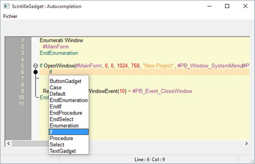

# ScintillaGadget

Une série de cinq exercices pour mieux appréhender le gadget Scintilla de la mise en place de GadgetScintilla() à la coloration syntaxique pour n'importe quel langage ou mots que vous souhaitez colorer. 

**Tuto 00 - Mise en place.pb** Mise en place du gadget Scintilla.

**Tuto 01 - Préliminaire.pb** Comment activer la touche TAB et neutraliser les caractères spéciaux.

**Tuto 02 - Indentation.pb** Indenter le texte par rapport à la position de la ligne précédente.

**Tuto 03 - Customisation minimum.pb** Couleur du gadget Scintilla et affichage de la numérotation des lignes.

**Tuto 04 - Autocompletion.pb** Compléter automatiquement le mot que l'utilisateur est en train décrire.

**Tuto 05 - Pliage et coloration syntaxique.pb** Pliage de code et colorer automatiquement des mots faisant parties d'une liste 

